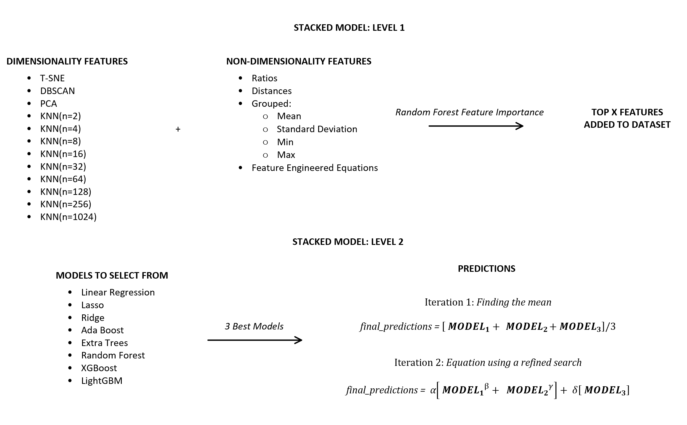

# Stacked Generalization or Ensemble Machine Learning

The following notebook is a work in progress. 

  

This notebook aims to be a template for regression tasks by stacking three machine learning models together. Using the hyper-optimisation library: Optuna, three of the above models are chosen, scaled uniquely and tunned.  These three predictions are then tunned inside the above equation. 

Areas for possible improvement: 

	- Additional parameters to tune
	- Classification models 
